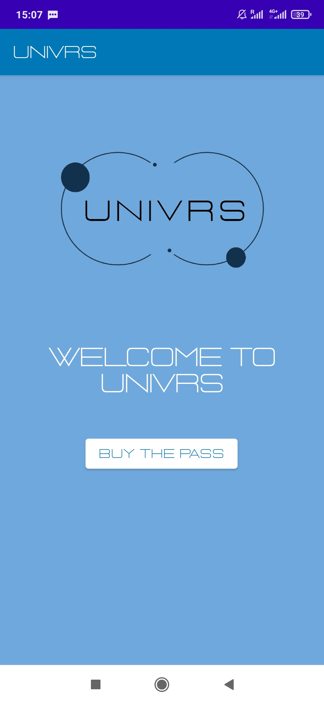
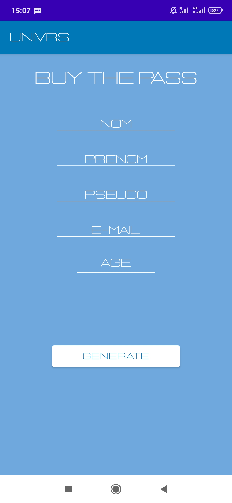
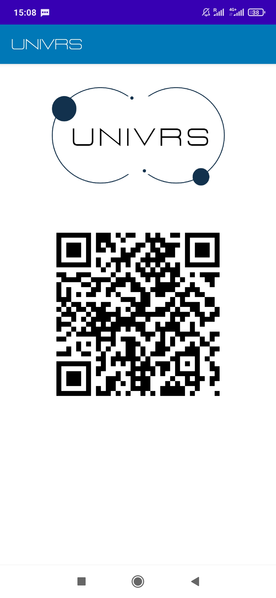

# UNIVRSs APP client  
Projet intensif 3A Application client

## Fonction  
L'application permet à l'utilisateur de d'acheter le pass UniVRs en s'inscrivant, se connecter et générer son QR Code joueur à présenter dans les salles VR.

## Fonctionnalités
### Page d'accueil

La page d'accueil contient un bouton qui invite l'utilisateur à acheter un pass UniVRs.

### Formulaire d'inscription

Le formulaire d'inscription invite les utilisateurs à rentrer les informations suivantes :
- nom
- prénom
- pseudonyme
- e-mail
- age
Une fois ces informations remplies, l'utilisateur pourra appuyer sur le bouton de génération et ainsi obtenir son QR Code joueur.

### QR Code

La page QR Code affiche le QR Code joueur à présenter à l'entreprise pour s'enregistrer.

## Technologies  
Développement android avec java.

## Outils de développement
Android Studio
